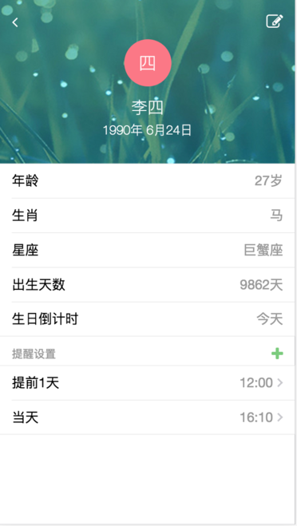

#### 项目状态

##### Master

[](https://travis-ci.org/qious/birthday)
[](https://coveralls.io/github/qious/birthday?branch=master)


##### Develop

[](https://travis-ci.org/qious/birthday)
[](https://coveralls.io/github/qious/birthday?branch=develop)


### **线上运行**

```bash
cd /path/to/birthday/server/
npm install
cp config/default.js config/local.js
cp pm2.sample.json pm2.json
npm run start
```

### **协作开发**

```bash
# 后端开发
cd /path/to/birthday/server
npm install
npm run dev

# 前端开发
cd /path/to/birthday/client
npm install
npm run dev
```

#### **单元测试**

```bash
cd /path/to/birthday/server
npm run test                # 运行所有测试
npm run test -- -g network  # 只测试 network
npm run cover               # 测试覆盖率
```

### **效果展示**


#### 生日列表


#### 生日详情



#### 微信生日列表


#### 生日提醒


